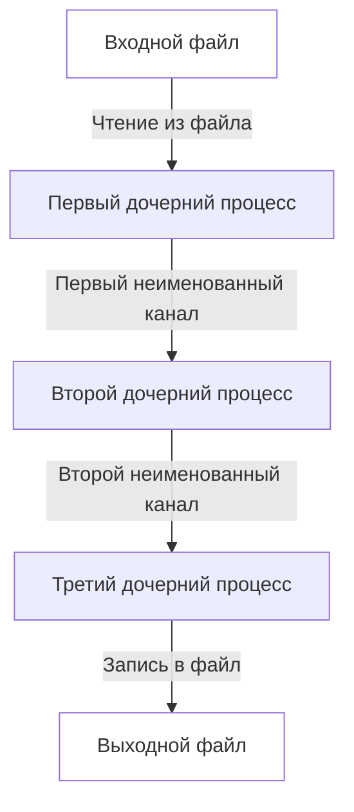
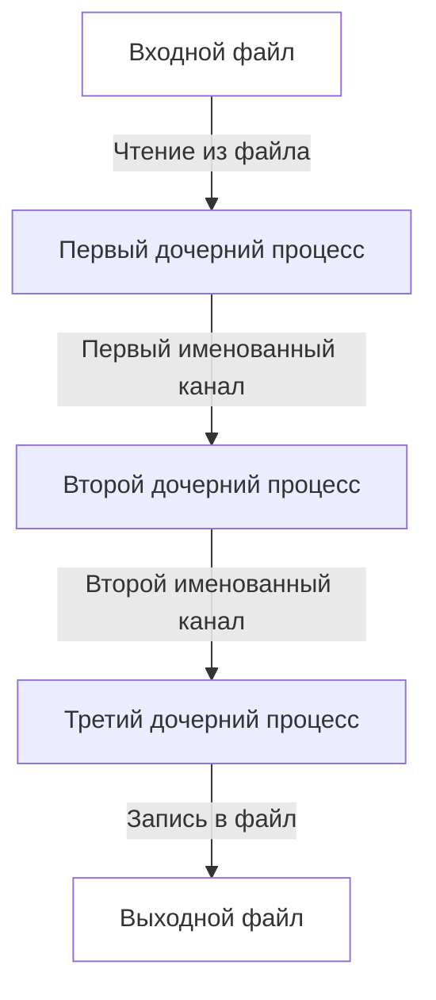
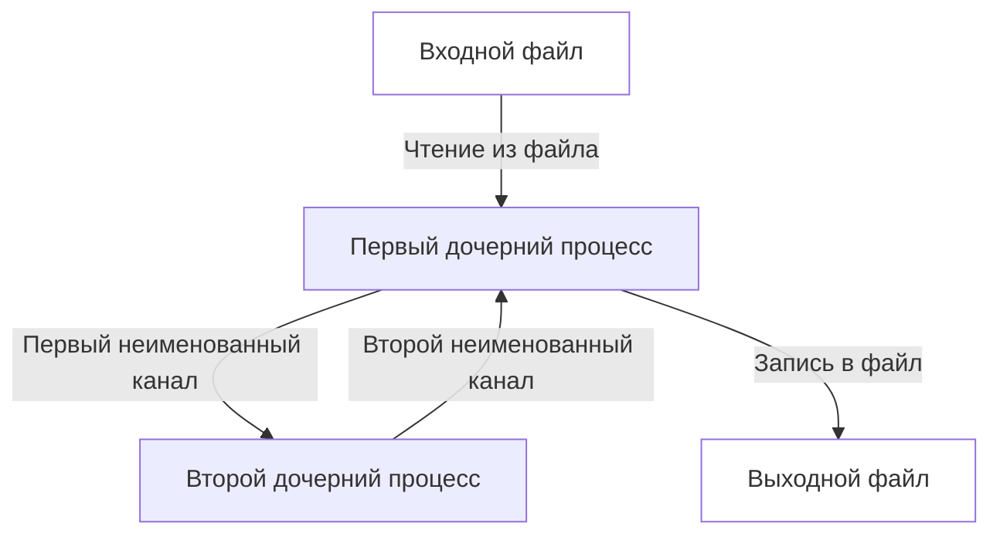
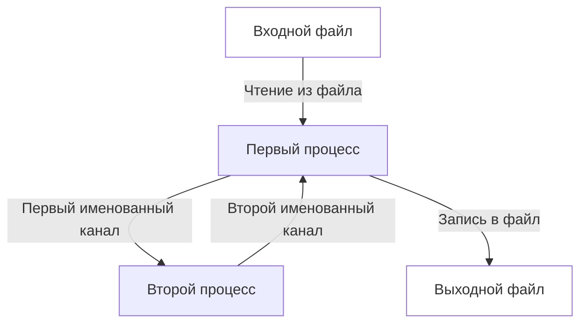
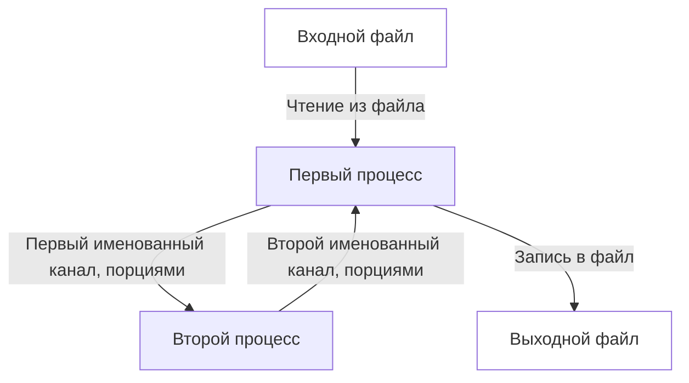

# Отчёт по ИДЗ 1

## Об отчёте

**Выполнил:** Каверин Максим Вячеславович

**Группа:** БПИ217

**Вариант:** 4

**Задание:** Разработать программу, находящую в заданной ASCII-строке последнюю при перемещении слева направо последовательность N символов, каждый элемент которой определяется по условию «больше предшествующего» (N вводится как отдельный параметр).

Данный отчёт разбит на блоки по оценкам для удобства проверки. Работа была выполнена с учетом требований до оценки 9 включительно.

Файлы, на которых проводилось тестирование программы находится в папке **tests**.

## На оценку 4

> Все относящиеся к данному этапу файлы находятся в папке **4**.

Согласно требованиям была разработана программа, принимающающая в качестве аргументов коммандной строки входной файл, выходной файл и число N.

Схема передачи данных:

Программа была запущена на тестовых данных при N равном 3, результаты совадают с ожидаемыми. 

## На оценку 5

> Все относящиеся к данному этапу файлы находятся в папке **5**.

Согласно требованиям была разработана программа, принимающающая в качестве аргументов коммандной строки входной файл, выходной файл и число N.

Схема передачи данных:

Программа была запущена на тестовых данных при N равном 3, результаты совадают с ожидаемыми. 

## На оценку 6

> Все относящиеся к данному этапу файлы находятся в папке **6**.

Согласно требованиям была разработана программа, принимающающая в качестве аргументов коммандной строки входной файл, выходной файл и число N.

Схема передачи данных:

Программа была запущена на тестовых данных при N равном 3, результаты совадают с ожидаемыми. 

## На оценку 7

> Все относящиеся к данному этапу файлы находятся в папке **7**.

Согласно требованиям была разработана программа, принимающающая в качестве аргументов коммандной строки входной файл, выходной файл и число N.

Схема передачи данных:

Программа была запущена на тестовых данных при N равном 3, результаты совадают с ожидаемыми. 

## На оценку 8

> Все относящиеся к данному этапу файлы находятся в папке **8**.

Согласно требованиям была разработана программа, принимающающая в качестве аргументов коммандной строки входной файл, выходной файл и число N.

Схема передачи данных:

Программа была запущена на тестовых данных при N равном 3, результаты совадают с ожидаемыми. 

## На оценку 9

> Все относящиеся к данному этапу файлы находятся в папке **9**.

Согласно требованиям была разработана программа, принимающающая в качестве аргументов коммандной строки входной файл, выходной файл и число N. При запуске файла main1.c передаются входной файл, выходной файл. При запуске файла main2.c передается число N.

Схема передачи данных:

Программа была запущена на тестовых данных при N равном 3, результаты совадают с ожидаемыми.
